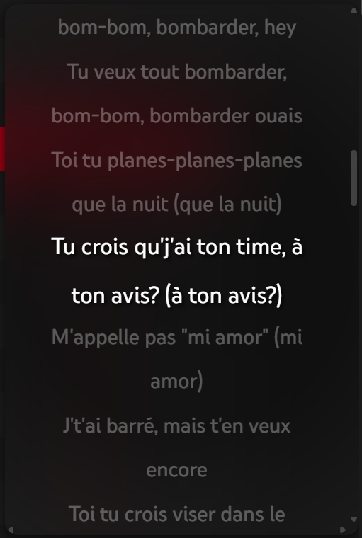
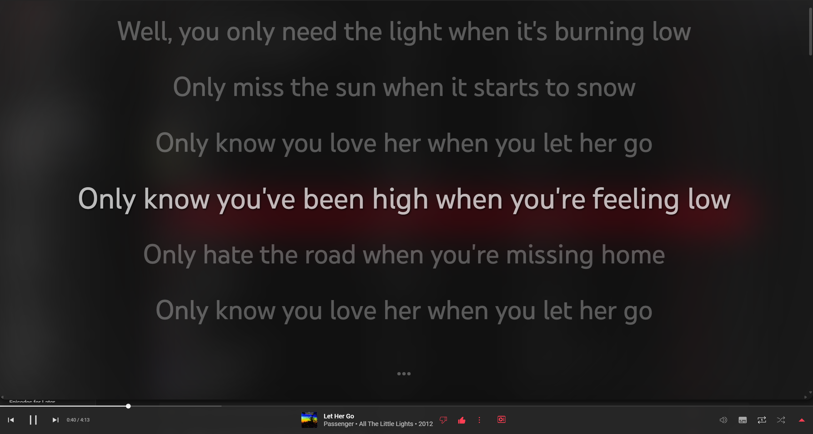

# Sycned Lyrics for YouTube Music Web App

This userscript simply adds synced lyrics support to YouTube Music's web app by utilizing Musixmatch API. (https://music.youtube.com/)

## Installation

Download **ViolentMonkey** and copy paste the content of `synced-lyrics.js` into a new script.
    
## Usage

After activating the script, you will find a new icon right next to your **Volume** icon at the bottom right of your player. Clicking the icon will open/close the lyrics panel.

Lyrics will be visible if lyrics exists for the current song.

Double clicking the panel will make the panel full screen.

If lyrics is not available for a song, the icon will be greyed out and you can't open the panel.

## Preview

### Small Lyrics Panel

### Fullscreen Lyrics Panel

## Future changes

- Fullscreen button to make the lyrics panel fullscreen instead of double clicking
- Settings panel for changing lyrics timing offset instead of using Keyboard shortcuts
- Word by word lyrics (if that's possible lol)
- Lyrics translation using Google's API
- Changeable fonts and font sizes

## Important

***If the lyrics are not perfectly synced, you can perform these actions to sync them yourself:***

- Press `X` to advance the lyrics by 100ms **(Lyrics will appear 100ms earlier)**
- Press `Shift+X` to delay the lyrics by 100ms **(Lyrics will appear 100ms later)**
- Press `Alt+X` to reset the delay to 0ms **(Basically resets the timing to default)**

## Extras

- Press `Z` to enable/disable lyrics auto-scrolling. **(When enabled, lyrics will scroll by itself)**